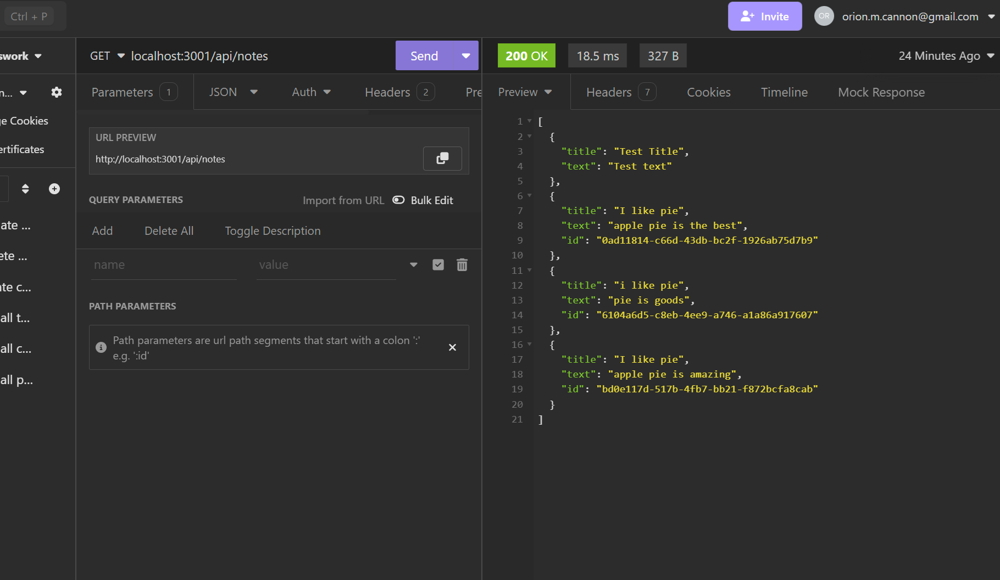

# expressjs notetaker

## Description

this is an application which utilizes express.js to track notes inside of a database

## Table of Contents

- [Installation](#installation)
- [Usage](#usage)
- [License](#license)
- [Contributing](#contributing)
- [Tests](#tests)
- [Questions](#questions)

## Installation

Fork my github repository

## Usage

Keep track of notes and store them in a local database

## Example And Screenshot

## License

https://opensource.org/licenses/MIT

This project is licensed under the MIT License.

## Contributing

n/a

## Tests

create and check notes using insomnia

## Questions

If you have any questions about this project, you can reach me at orion.m.cannon@gmail.com
or you can find me on GitHub at [OrionC11](https://github.com/OrionC11).
